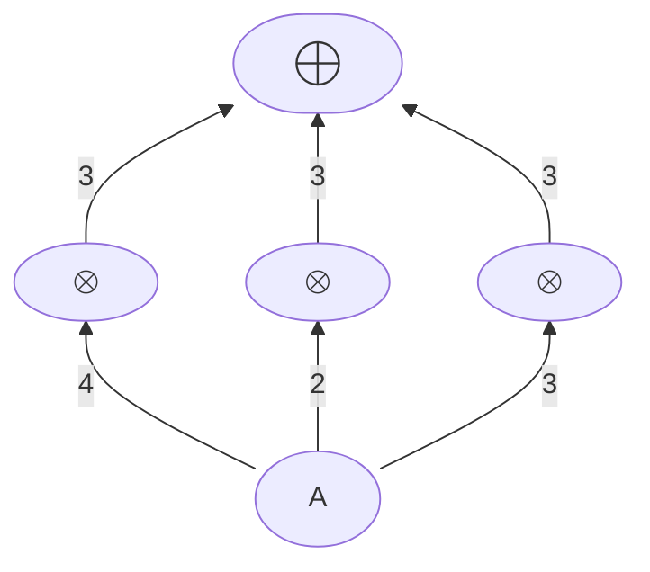

## hourglasses

⋈ ⧖ ⧔ ⧓ ⧖

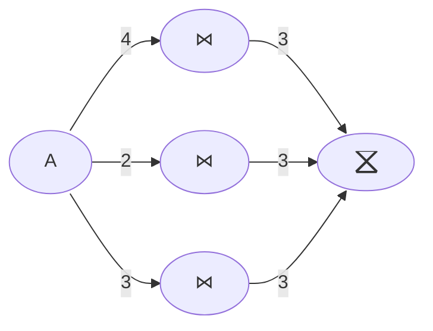

## nested intersection / union

	


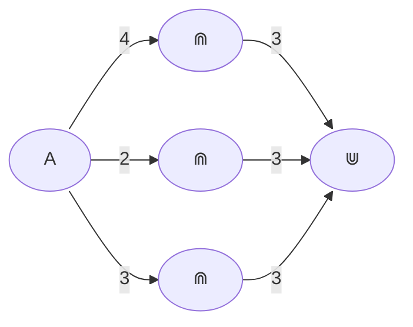

## other nested


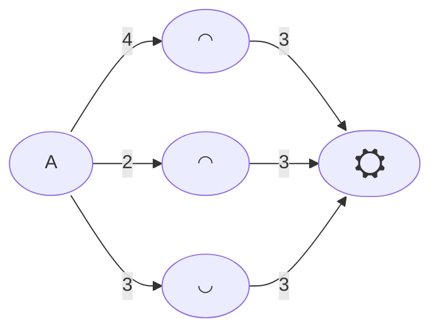

## shields
☖ ☗

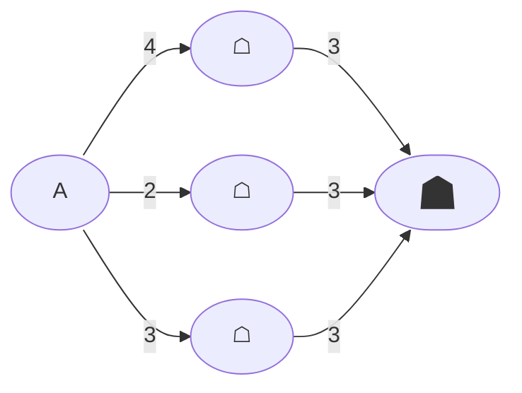


## h hourglass + 4pin star


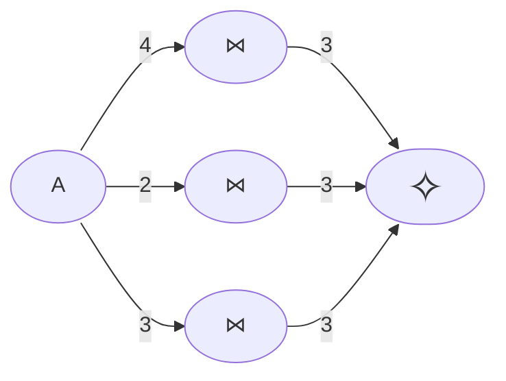


## 4 pin stars
✦✧


### Alchemy 1

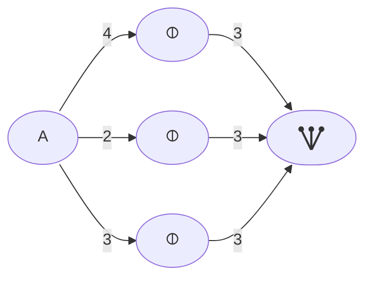

### Alchemy 2

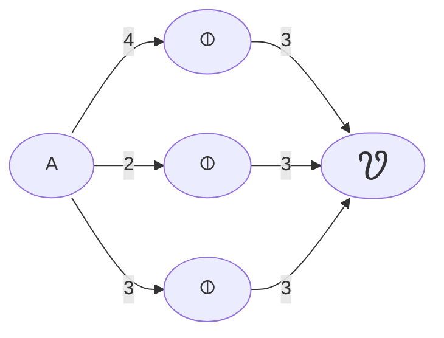


### Alchemy 3

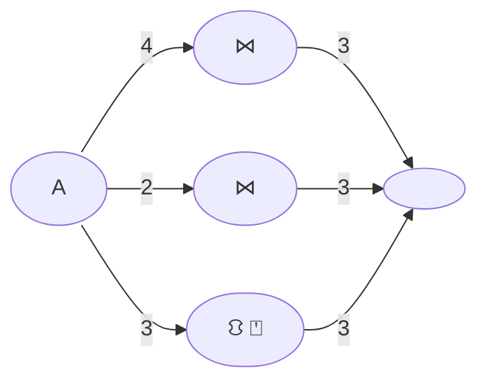


### Runic 1

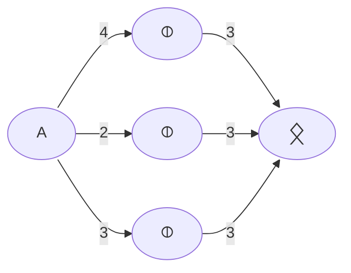


### Runic 3

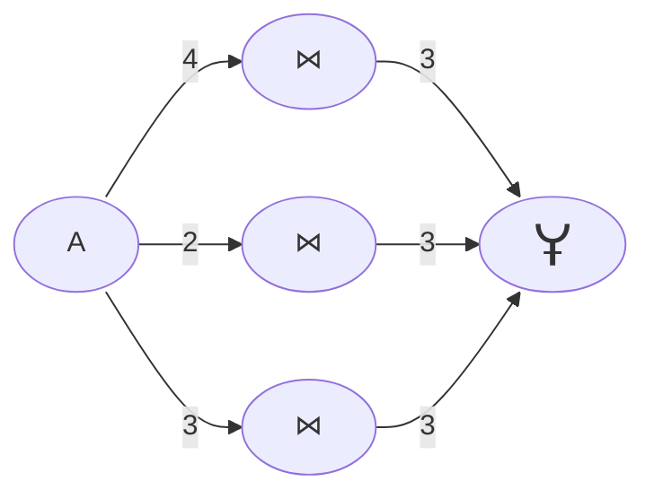

## Alchemy 5

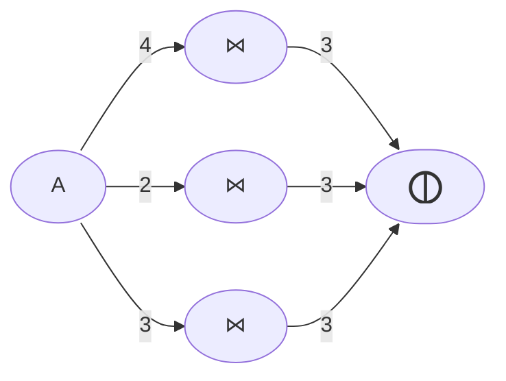


## Alchemy 5

㉦ ㅂ

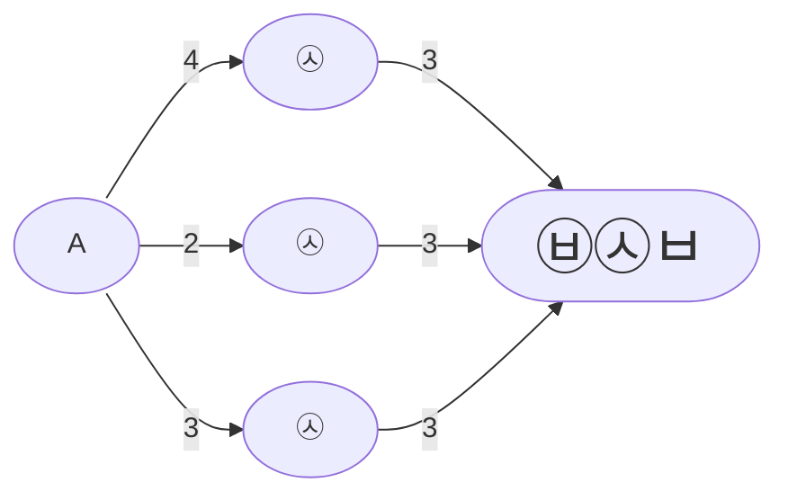


## Alchemy 5

⧉ ✜

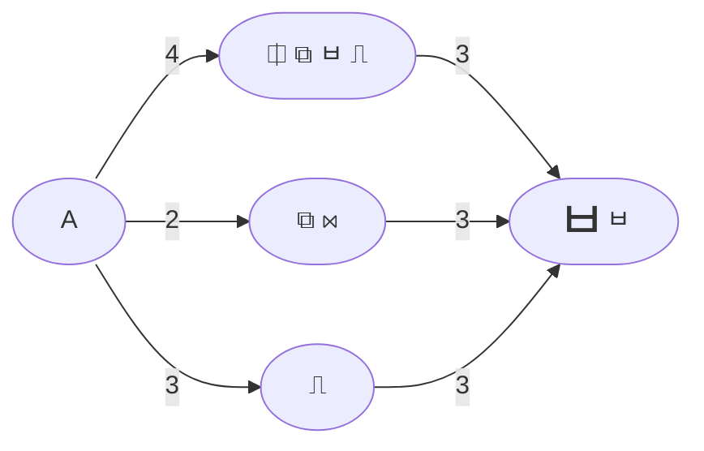


## Alchemy 6

⧉ ✜  ⋈ ㅂ ⎅ ◫

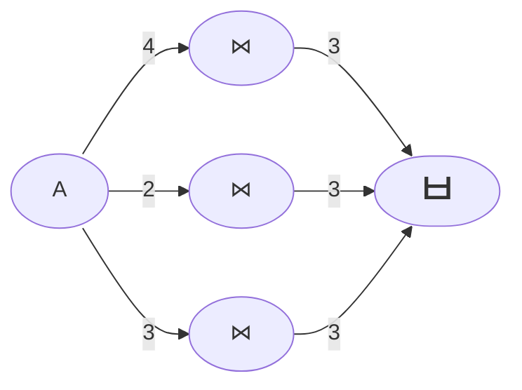


## Alchemy 7

⧉ ✜  ⋈ ㅂ ⎅ ◫

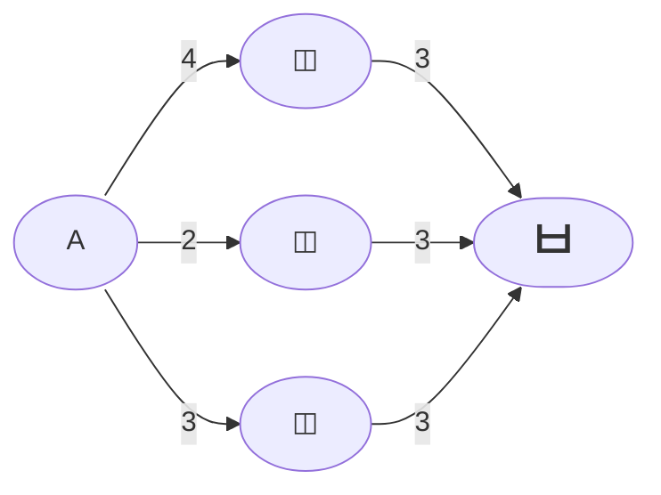


## Alchemy 8

⧉ ✜  ⋈ ㅂ ⎅ ◫

🜕 ◫ ㅂ

⩎ ⩏

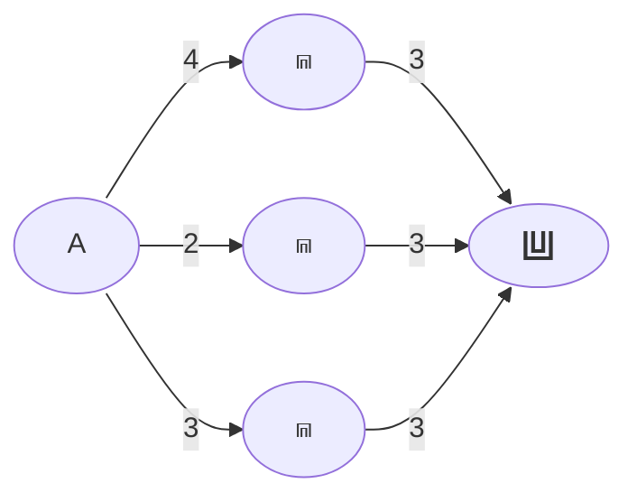


## Alchemy 9

⧉ ✜ ⋈ ⋈ ◫ 🝊 ㅂ ⎅ ◫
🝊 ꗯ ⋈ ⨝ ◫
🜕 ◫ ㅂ

⩎ ⩏

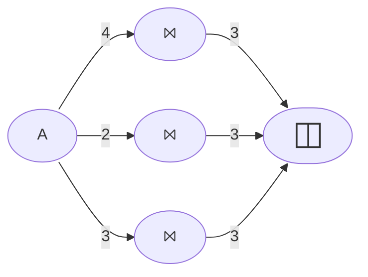


## Alchemy 10

⧉ ✜  ⋈ ◫ 🝊 ㅂ ⎅ ◫
🝊
🜕 ◫ ㅂ

⩎ ⩏


## Alchemy 11

a ◫ b   
a 🜕 b


⧉ ✜ ◲ ⋈ ◫ 🝊 ㅂ ⎅ ◫ ꯡ
🝊
🜕 ◫  ㅂ

⩎ ⩏

☐

### Alchemy 12

```mermaid
graph LR


B[🜕]
C[🜕]
D[🜕]
E[$$\LARGE ◫  $$  ]


A -- 4 --> B
A -- 2 --> C
A -- 3 --> D

B -- 3 --> E
C -- 3 --> E
D -- 3 --> E


classDef default rx:40,ry:40;

```

### Alchemy 13

ꛘ 으 므 오 모

```mermaid
graph LR


B[오]
C[오]
D[오]
E[$$\LARGE 모  $$  ]


A -- 4 --> B
A -- 2 --> C
A -- 3 --> D

B -- 3 --> E
C -- 3 --> E
D -- 3 --> E


classDef default rx:40,ry:40;

```

### Alchemy 14

Ⰾ Ⰺ ➰:too emoji like, bad contrast

```mermaid
graph LR


B[➰]
C[➰]
D[➰]
E[$$\LARGE Ⰾ  $$  ]


A -- 4 --> B
A -- 2 --> C
A -- 3 --> D

B -- 3 --> E
C -- 3 --> E
D -- 3 --> E


classDef default rx:40,ry:40;

```


### Alchemy 15

Ⰾ Ⰺ Ⱓ 日 ത ꚸ ➰:too emoji like, bad contrast
⩍ ⏼ ヰ 🜕 ↀ ㉤ ㉦ ⩩ ❍ ❒ ❑  ⩌ ▦ ▞

```mermaid
graph LR


B[❍]
C[❍]
D[❍]
E[$$\LARGE ❒  $$  ]


A -- 4 --> B
A -- 2 --> C
A -- 3 --> D

B -- 3 --> E
C -- 3 --> E
D -- 3 --> E


classDef default rx:40,ry:40;

```


### Path-finding problems in graphs

p157 Gondran-Minoux gondran-minoux-graphs-dioids-and-semirings-new-models-and-algorithms

See Algorithm 4 p152: 

Algorithm 4 (Generalized Gauss–Jordan): Computation of the matrices A+ and A∗

Let us consider here the case where B = I

Algorithm 4' Computation of A^+ and A^∗ in the case where G(A) does not contain a 0-absorbing circuit
```
(a) A^[0] = A
(b) For k = 1 . . . n
        For i = 1 . . . n
            For j = 1 . . . n
                a_ij^[k] ← a_ij^[k−1] ⊕ a_ik^[k−1] ⊗ a_kj^[k−1]  ;
            Endfor
        Endfor
    Endfor
(c) A^+ = A^[n] and A^∗ = I ⊕ A^[n]
```

**In the case of the shortest path problem in a graph without negative length circuits
(⊕ = Min, ⊗ = +) algorithm 4' is none other than Floyd’s algorithm (1962).**

Algorithm 5 is the generalized “escalator” method, seems more complex.

G -> 
A -> 
E ->  
⊕ -> MERGE?
⊗ -> JOIN? 
ε -> ZERO
e -> ONE   

Identity matrix I -> I?


ℝ̅ = The set R ∪ {+∞} ∪ {−∞}

| Problem types   | Problems solved  | E     | ⊕   | ⊗     | ε      |    e           |
| --------------- | ---------------- | ----- | ---- | ----- | ------ | -------------- |
| **Existence**   | Connectivity     | {0, 1}| Max  | Min   | 0      | 1              |   
| **Enumeration** | Generation of elementary paths  | 𝒫(X*) | Union | Latin multiplication | ∅ | X |
|**Enumeration**|Multicriteria problems|𝒫(ℝ̅^p)|Set of efficient paths of the union|Set of efficient paths of the sum|+∞^p|(0)^p|
| **Enumeration**|Generation of regular languages (Kleene)|Set of words|union|concatenation|∅|the empty word|
| **Optimization** | Maximum capacity path | ℝ₊ ∪ {+∞} | Max | Min | 0 | +∞     | 
| **Optimization** | Minimum spanning tree, hierarchical classification | ℝ̅ , ℝ₊| Min| Max     | +∞     |-∞, 0|
|**Optimization**| Minimum cardinality path |      ℕ ∪ {+∞}         |          Min          | + |  +∞     | 0  |
|**Optimization**|      Shortest path       |    ℝ₊ ∪ {+∞}           |          Min         | +  |  +∞     | 0  |  
|**Optimization**|       Longest path       |    ℝ₊ ∪ {+∞}           |           Max        | +  | -∞      | 0  | 
|**Optimization**| Maximum reliability path | {a | 0 ≤ a ≤ 1}        |           Max        | ×  | 0  | 1| 
|**Optimization**| Reliability of a network | Idempotent polynomials |Symmetrical difference| ×  | 0  | 1 |
| **Counting**   |        Path counting     |           ℕ            |        +             | ×  | 0  | 1 |
| **Counting**   |       Markov chains      |  {a | 0 ≤ a ≤ 1}       |       +              | ×  | 0  | 1|
|**Opt & post-optimization** | k-th shortest path problem| Cone of ℝ̅₊^k       | k smallest temrs of the 2 vector  |k smallest vectors of the sums of pairs    | (+∞)^k | (0,+∞,...,+∞) |  
|**Opt & post-optimization** | η-optimal paths| Ordered sequence of terms of ℝ of amplitude η | Sequence formed by the k smallest sums of pairs of elements of the two sequences | (+∞)    | (0)    | 

---

Would you like me to format it as a **LaTeX table** or **CSV file** as well (for easier reuse in papers or code)?


**Character example**

ㄕ⁰ = code point ㄕ¹ = character ㄕ² = token


```mermaid
block-beta
 columns 3
  
  block:sinistra      
      columns 1
      Domain
      A1(["A"])
      B1(["B"])
      
      F1(["F"])
      U1(["U"])
      N1(["N"])
      Y1(["Y"])
      
      Z1(["Z"])
      
  end

  
  %% Needed to fill in, feels hacky because of immature lib (v11.0)
  %% normal charts misalign badly
  block:colcentrale 
    columns 1
    A["  aaaaaaa "]
     
    style A fill:#0000,stroke:#0000,color:#0000;
    style colcentrale fill:#0000,stroke:#0000 
  end

  block:destra
      columns 1
      Codomain
      A2(["A"])
      B2(["B"])

      F2(["F"])
      U2(["U"])
      N2(["N"])
      Y2(["Y"])      
      
      Z2(["Z"])

  end

  F1-- "w978, 1" -->U2
  U1-- "w978, 2" -->N2
  N1-- "w978, 3" -->N2
  N1-- "w978, 4" -->Y2

  

```


**Character example**

```
 CAR     BALLADS

 C   B   L 
     A   D
 R       S
```


ㄕ⁰ = code point ㄕ¹ = character ㄕ² = token

Each edge holds a word id and the sequence number. 

```mermaid
%%{init: { "flowchart": { "defaultRenderer": "elk" } }}%%
flowchart RL

  subgraph car
      direction TB
      C(["C"])
      R(["R"])    

      style car fill:#FD66, ;
  end


  subgraph common
      direction TB
      A(["A"])
      B(["B"])

      style common stroke-width:10,stroke:#2301, fill:#0000;
  end


  subgraph ballad
    L(["L"])
    D(["D"])
    S(["S"])

    style ballad stroke-width:20, stroke:#F001,fill:#0000;
  end

  B-- "w58, 1" -->A
  A-- "w58, 2" -->L
  L-- "w58, 3" -->L
  L-- "w58, 4" -->A
  A-- "w58, 5" -->D
  D-- "w58, 6" -->S

  C-- "w74, 1" -->A
  A-- "w74, 2" -->R


```

###  Mermaid horror

```mermaid
graph TD

    subgraph Vets
        L[👩‍⚕️ Dr Lee]
        K[👨‍⚕️ Dr Kim]
        Z[Dr Z]
    end

    subgraph Owners
        subgraph Bianco family
            O1[🙂 Alice]
            O2[😎 Bob]
        end
        subgraph Verdi family        
            O3[👨 Charlie]
            O4[👩 Lisa]
            O5[👧 Emma]
        end
    end

    subgraph Dogs
        D1[🐕 Fido]
        D2[🐩 Bella]
        D3[🦮 Spot]
    end

    subgraph Peppo
      D1
      O1
    end


    C -- talks_to --> O1
    C -- sffd     --> C
    R -- talks_to --> O3

    O1 -- owns --> D1 & D2
    O2 -- owns --> D1 & D2
    O3 -- owns --> D3
    O4 -- owns --> D3
    O5 -- owns --> D3
    
```


### blokky

```mermaid
block
  columns 8
  
  block:sx:2
    columns 1
    
    C(["C"])
    space:2
    R(["R"])    

    style sx stroke-width:330, stroke:#FFD600;
  end

  space:1

  block:cr:2
    columns 1
    A2([" "])
    A(["A"])
    B(["B"])

    style cr stroke-width:1,stroke:#0000,fill:#0000;
    style A2 fill:#0000, stroke:#0000
  end

  space:1
  

  block:dx:2
    columns 3

    L(["L"]):1 space:2
    space:3
    
    space:2 L2([" "]):1
    D(["D"]):3
    space:3
    S(["S"]):3   
    space:3
    
    style L2 fill:#0000, stroke:#0000
    style dx stroke-width:330, stroke:#F001,fill:#0000;
  end
  

  B-- "w58, 1" -->A
  A-- "w58, 2" -->L
  L-- "w58, 3" -->L2
  L2-- " " -->L
  L-- "w58, 4" ---A2
  A2     --->     A
  A-- "w58, 5" -->D
  C-- "w74, 1" -->A
  A-- "w74, 2" -->R


  ```


## Relation pandas-style

```
R[property][i] = j
R[property,'w'][i] = weight of i ??   use multiindex ??

R['address']
R['address'][웃_1] == 🏠_3
R['address'] == Series[🏠_1,🏠_2, 🏠_3 ....]
R['address'] == Series[🏠_1,🏠_2, 🏠_3 ....]
```

## Term Rewriting Engine


### More in depth 

Rubi's magic is not Mathematica - it's the decision-tree rewrite system:

- every rule is a pure symbolic pattern
- conditions are pure symbolic predicates
- the rewriting engine itself is tiny
- tens of thousands of rules produce very deep reasoning

Rubi’s design principles:

- Everything is a term
- All knowledge is rewrite rules
- Rules are extremely local
- Rule ordering matters
- Coverage is ensured by tree structure, not by semantics

Rubi is basically: Mathematics = structured rewrite database + tiny normalizer engine.

### Pictoji desiderata:

- character-level syntax
- full freedom in naming
- arbitrary user-defined theories
- symbolic rewriting
- proof-ability (if needed)
- scalable rulebases
- clear separation of kernel vs semantics
- compatibility with natural-language inference

Pictoji SHOULD be divided in:

- a tiny formal kernel (Metamath-like)
- a big rewrite rulebook (Rubi-like)
- a typed relational model (Pictoji meaning algebra)


### The Foundations

- prefer class name vs "sort" (too academic)
- heading is the theory name, refer to it as lowercase hyphened `the-foundations` like as in  [markdown links](the-foundations).
- Defs with 4 spaces or three backticks blocks


    class Rel[D,C,V]:           # Python style
        domain:   Set[D]
        codomain: Set[C]
        cells:    Dict[(C,D),V] 

    class Owns[D,C,Bool] (Rel[D,C,Bool]):
        pass

    class DogOwners(Owns):
        pass

    JoinOp:      Rel ⨝ Rel -> Rel    # ⨝ inside to directly signal infix? 

    1 : Final[Rel]      # Python-inspired const

    웃 : Rel            # unicode, var


Named rules as (typed) functions with 4 spaces:

    join_id_exp:  (e ⨝ 1) <- e      # unbounded - DOES *NOT* look at the context

    join_id_exp(e):  (e ⨝ 1) <- e      # bounded

    join_id_simp(e : Rel) -> Rel:  (e ⨝ 1) -> e   # bounded, with typing      

More structured rule with guards, no exceptions but `Err` (rule ignored)

    join_id_dog_exp(e : Rel) -> Rel:  
        e IF e is Dog  ->  e ⨝ 1_Dog   
                  _  ->  Err


Axioms as functions, MUST really produce truths (TODO more specific type?). 
Always start with `ax_`

    ax_join_id_r_all(e:Rel) -> Expr:  (e ⨝ 1) == e    

Theorems as functions, MUST produce truths derived from axioms (TODO more specific type?). 
Always start with `thm_`

    thm_join_id(e:Rel) -> Expr:  (e ⨝ 1) == e 

Non-ax, non-thm equality is basically a conjecture/test, may or may not be true`. 
Always begins with `test_`

    test_ow2_dup:   웃 웃 == 웃²


### The Foundations 2

We need to fix the notation

ஃ = set       nl
ஃ^ = Set      nl

System types:
    T = t^
    ஃ[t]^^ = SET[T]    (t is implicitly capitalized)
    ஃ[T]^^ = SET[T]    
    ஃ[T]^^1 = SET[T]   
    ஃ[T]^^n = SET[T] X SET[T] X .... X SET[T]    n times  
    🝚[T]^^ = LIST[T] 
    ...

if T is a System type then the resulting expression is considered a System type. 


ஃ[T]^^ == SET[T]            # System type, T is implicitly uppercased
ஃ[웃]^^ == SET of Person     # Non-system type (person is not system)

ஃ[T]^ == Set[T]
ஃ[웃^]^ == Set of Person

웃^ = SET[웃] = ஃ[웃]^^  the SET of all persons
웃_1 = a specific person, an Atom,  e.g. Alice
웃_1 ∈ 웃^
웃 = 웃^1 = person 'query'   
웃 ⊆  웃^  
웃  ∈  ℘(웃^) 
웃[1] = first result from person query, e.g. Alice
웃[1] ∈ 웃
웃^ X 웃^ =  Person X Person  =  ஃ[웃]^^2   
웃^ X 웃^ X 웃^ = ஃ[웃]^^3


### The Foundations 3


s               symbol
s^              type S of s
s^ ¬∈ s^1      a bit weird I know but don't worry about it too much

Types
    웃^ = Person
    웃^ ¬∈ 웃^1
    웃^ X 웃^ =  Person X Person  =  웃^ X 웃^   
    웃^ X 웃^ X 웃^ X .... = 웃^ XX n     # TODO maybe not needed, keep here for reference 

System types

    Set, List

    ஃ = set       natural language
    ஃ^ = Set      

    ஃ^[T] = Set[T]    T is a generic type
    ஃ^[S^] -> S^      reduction to prevent loops (S is a symbol)

    ஃ^[웃^] -> 웃^     The Set of all persons


Atoms
    웃_1 = a specific person, an Atom,  e.g. Alice
    웃_1 ∈ 웃^

Queries

웃 = 웃^1 = person 'query'   
웃 ⊆  웃^  
웃  ∈  ℘(웃^)     # 웃 is a finite subset of the Person universe
웃[1] = first result from person query, e.g. Alice. Indexing starts from 1.
웃[1] ∈ 웃


## Markdown experiments

"Markdown in markdown" could solve some problems
when in need avoid lists / preserve spaces / need to display clickable links 

```markdown

[foo](https://ciao.com)
bar
```


## Types

TODO just a draft, define better

-> = link
<- = backlink
<-> = bidirectional link


- all properties values are finite. 
- properties are _not_ links to other entities.

☉.P = access property P. 
☉.L = access link L. A link is a set of pointers to other entities.

Type declaration

```
웃^ = ᛠ^:
  name : Str
  age  : Nat
  friends <-> 웃^
  home -> 🏠^ 
  TODO backlinks
```

웃^ = ᛠ: name : Str; age : Nat


웃^ = ☉^:
  name : Str
  age  : Nat


```
웃^ = ☉^[name : Str, age : Nat]
```

```
웃^ = ☉^[
    name : Str
    age  : Nat
]
```


## References

- Tensor semantics / DisCoCat — categorical linguistics uses a similar compositional, Fock-space-like construction.

- Knowledge-graph embeddings — treat n-ary relations as tensors and learn numerical weights for them.